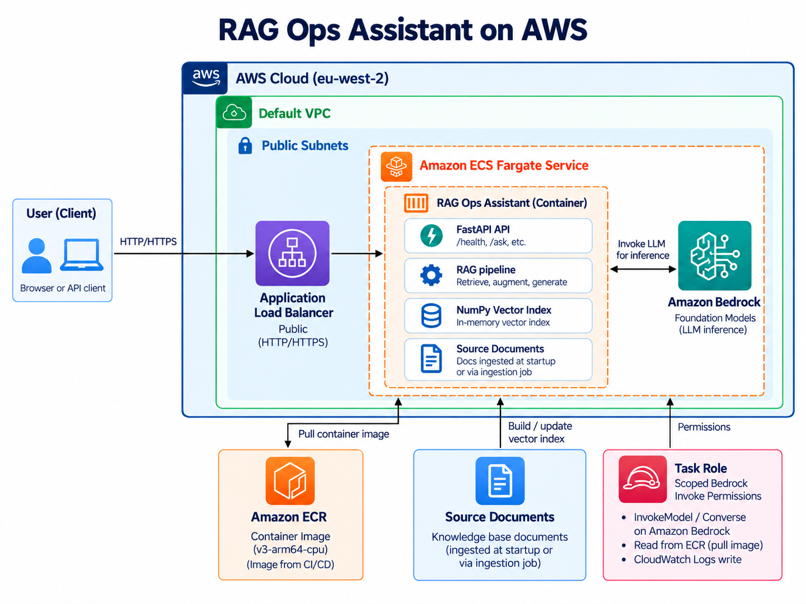
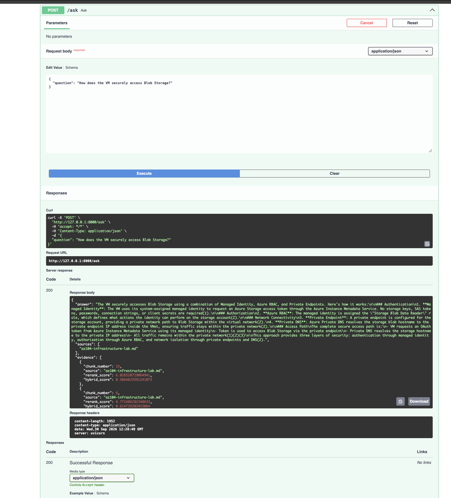
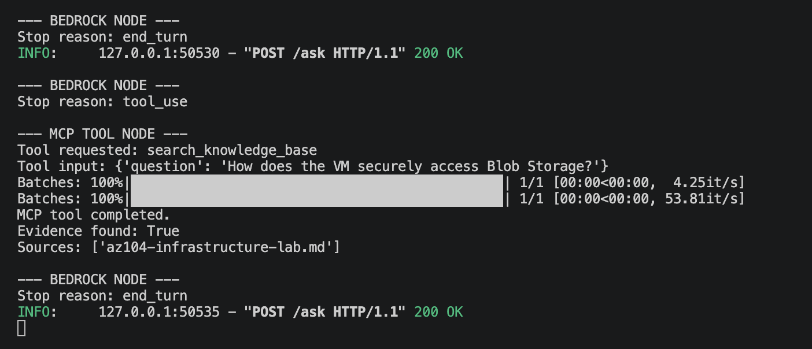

# RAG Ops Assistant

An AI-powered operations assistant that combines **Retrieval-Augmented Generation (RAG)**, **Amazon Bedrock**, **Model Context Protocol (MCP)**, **LangGraph**, and **FastAPI**.

The assistant can answer questions from a curated operations knowledge base, expose retrieval as an MCP tool, route tool calls through LangGraph, and return grounded answers with source and evidence metadata.

<p align="center">
  
</p>

---

## Architecture

```text
Client
  |
  v
FastAPI
  |
  v
LangGraph
  |
  v
Amazon Bedrock / Nova
  |
  +----------------------+
  |                      |
  | direct answer        | tool_use
  |                      v
  |                  MCP Client
  |                      |
  |                      v
  |                  MCP Server
  |                      |
  |                      v
  |              search_knowledge_base
  |                      |
  |                      v
  |                  RAG Engine
  |              /               \
  |       Hybrid Search        Reranker
  |              \               /
  |               Grounded Evidence
  |                      |
  +----------------------+
             |
             v
     Answer + Sources + Evidence
```
---

## Demo Screenshots

### Architecture Diagram

The diagram below shows the end-to-end flow from the API request through LangGraph, Amazon Bedrock, MCP, and the RAG retrieval pipeline.

<p align="center">
  
</p>

### Grounded API Query

The `/ask` endpoint returns a grounded answer together with the source documents and retrieval evidence used to support the response.

<p align="center">
  
</p>

### MCP Tool Invocation Flow

The terminal trace below shows LangGraph routing a knowledge-base question to Amazon Bedrock, Bedrock requesting the MCP tool, the MCP server executing `search_knowledge_base`, and the retrieved evidence being returned before the final model response.

<p align="center">
  
</p>

---

## Key Features

- Hybrid retrieval using semantic and keyword search
- Sentence Transformer embeddings
- Cross-encoder reranking
- Relevance guard for unsupported questions
- Amazon Bedrock model integration
- MCP tool discovery and invocation
- LangGraph-based agent orchestration
- Hard no-evidence guard to reduce hallucination risk
- Persistent MCP service for API requests
- FastAPI REST API
- Structured source and evidence metadata
- Retrieval evaluation suite

---

## Agent Routing

The LangGraph workflow supports three main paths.

### 1. General question

```text
User
  |
  v
Bedrock
  |
  v
end_turn
  |
  v
Final answer
```

No MCP tool is required.

### 2. Knowledge-base question

```text
User
  |
  v
Bedrock
  |
  v
tool_use
  |
  v
MCP
  |
  v
RAG retrieval
  |
  v
Evidence found
  |
  v
Bedrock
  |
  v
Grounded answer
```

### 3. Unsupported knowledge-base question

```text
User
  |
  v
Bedrock
  |
  v
tool_use
  |
  v
MCP
  |
  v
RAG retrieval
  |
  v
No evidence
  |
  v
Hard LangGraph guard
  |
  v
Fixed abstention response
```

The no-evidence path stops before the model can generate unsupported information.

---

## Knowledge Base

The current knowledge base contains documentation from several infrastructure and platform engineering projects:

- Azure infrastructure lab
- CloudOps Command Center
- Platform Engineering Observability
- PlatformPilot

The indexed documents are stored under:

```text
data/
```

Generated vector index files are stored under:

```text
index/
```

The `index/` directory is intentionally excluded from Git.

---

## Retrieval Pipeline

The retrieval system uses multiple stages:

```text
Question
  |
  v
Embedding
  |
  +-------------------+
  |                   |
  v                   v
Semantic Search   Keyword Search
  |                   |
  +---------+---------+
            |
            v
       Hybrid Score
            |
            v
     Candidate Results
            |
            v
   Cross-Encoder Reranker
            |
            v
    Relevance Filtering
            |
            v
      Grounded Context
```

Embedding model:

```text
sentence-transformers/all-MiniLM-L6-v2
```

Reranker:

```text
cross-encoder/ms-marco-MiniLM-L-6-v2
```

---

## Project Structure

```text
rag-ops-assistant/
├── data/
│   ├── az104-infrastructure-lab.md
│   ├── cloudops-command-center.md
│   ├── platform-engineering-observability.md
│   └── platform-pilot.md
│
├── evals/
│   └── retrieval_cases.json
│
├── src/
│   ├── __init__.py
│   ├── agent.py
│   ├── api.py
│   ├── evaluate.py
│   ├── ingest.py
│   ├── langgraph_agent.py
│   ├── mcp_agent.py
│   ├── mcp_server.py
│   ├── rag_core.py
│   ├── retrieve.py
│   └── tools.py
│
├── .gitignore
├── README.md
└── requirements.txt
```

---

## Requirements

- Python 3.11+
- AWS account with Amazon Bedrock access
- AWS credentials configured locally

Install dependencies:

```bash
python -m venv .venv
source .venv/bin/activate
python -m pip install -r requirements.txt
```

---

## Build the RAG Index

Run:

```bash
python -m src.ingest
```

This creates the local retrieval index from the Markdown documents inside `data/`.

---

## Run Retrieval Evaluation

```bash
python -m src.evaluate
```

The evaluation suite checks retrieval behavior for both supported and unsupported questions.

---

## Test the MCP Server

Start the MCP server directly:

```bash
python -m src.mcp_server
```

The server exposes:

```text
search_knowledge_base
```

The tool accepts:

```text
question: string
```

and returns structured fields including:

```text
found
message
context
sources
evidence
```

---

## Run the LangGraph Agent

Set the AWS profile that has access to Bedrock:

```bash
AWS_PROFILE=<your-aws-profile> python -m src.langgraph_agent
```

Example question:

```text
How does the VM securely access Blob Storage?
```

---

## Run the API

Start FastAPI:

```bash
AWS_PROFILE=<your-aws-profile> python -m uvicorn src.api:app --reload
```

API documentation:

```text
http://127.0.0.1:8000/docs
```

Health endpoint:

```bash
curl http://127.0.0.1:8000/health
```

Expected response:

```json
{
  "status": "ok",
  "service": "rag-ops-assistant"
}
```

---

## Ask a Knowledge-Base Question

```bash
curl -X POST http://127.0.0.1:8000/ask \
  -H "Content-Type: application/json" \
  -d '{"question":"How does the VM securely access Blob Storage?"}'
```

Example response shape:

```json
{
  "answer": "Grounded answer generated from retrieved evidence.",
  "sources": [
    "az104-infrastructure-lab.md"
  ],
  "evidence": [
    {
      "chunk_number": 15,
      "source": "az104-infrastructure-lab.md",
      "rerank_score": 6.02,
      "hybrid_score": 0.58
    }
  ]
}
```

---

## No-Evidence Behavior

For a question outside the knowledge base:

```bash
curl -X POST http://127.0.0.1:8000/ask \
  -H "Content-Type: application/json" \
  -d '{"question":"What is the company annual leave policy?"}'
```

The application returns:

```json
{
  "answer": "The knowledge base does not contain sufficient information to answer that question.",
  "sources": [],
  "evidence": []
}
```

This response is enforced by LangGraph control flow rather than relying only on prompt instructions.

---

## Technology Stack

| Component | Technology |
|---|---|
| API | FastAPI |
| Agent orchestration | LangGraph |
| LLM | Amazon Bedrock / Amazon Nova |
| Tool protocol | MCP |
| Embeddings | Sentence Transformers |
| Reranking | Cross Encoder |
| Retrieval | Hybrid semantic + keyword search |
| Validation | Pydantic |
| AWS SDK | boto3 |

---

## Tested Dependency Versions

```text
boto3==1.43.104
fastapi==0.141.1
langgraph==1.2.12
mcp[cli]==2.2.0
numpy==2.4.6
pydantic==2.13.5
sentence-transformers==6.1.0
uvicorn==0.54.0
```

---

## Design Principles

This project separates responsibilities across layers:

```text
RAG
= retrieves relevant evidence

MCP
= standardizes how tools are exposed and discovered

Bedrock
= selects tools and generates responses

LangGraph
= controls state, routing, loops, and guardrails

FastAPI
= exposes the system through an HTTP API
```

A key design decision is that unsupported retrieval results are handled with application-level control flow:

```text
found = False
     |
     v
LangGraph END
     |
     v
Fixed abstention response
```

This prevents the LLM from generating additional unsupported advice after the retrieval layer reports that no evidence exists.

---

## Current Status

The following flows have been tested successfully:

- Health endpoint
- General direct-answer route
- Known knowledge-base retrieval route
- Unknown knowledge-base abstention route
- MCP tool discovery
- MCP tool execution
- Persistent MCP service reuse
- Structured sources and evidence
- Empty-question validation
- Retrieval evaluation

---

## Future Improvements

Possible next iterations include:

- Automated API tests
- LangGraph tracing and observability
- CI/CD with GitHub Actions
- Containerization with Docker
- Authentication and authorization
- Remote MCP transport
- Cloud deployment
- Additional operational tools
- Expanded evaluation datasets


Author

Olawale Azeez
AWS Certified Developer Associate AWS Certified Solutions Architect -Associate
AWS Certified Cloud Practitioner
Cloud Engineer | Platform Engineer | DevOps Engineer