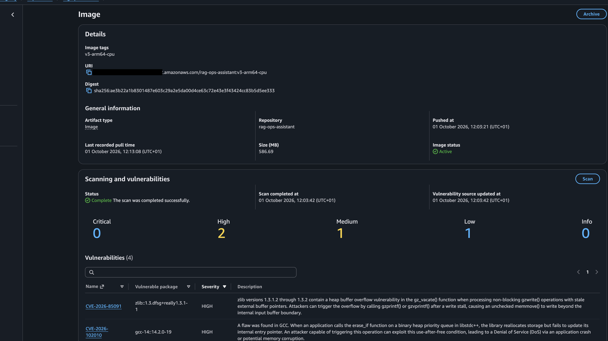
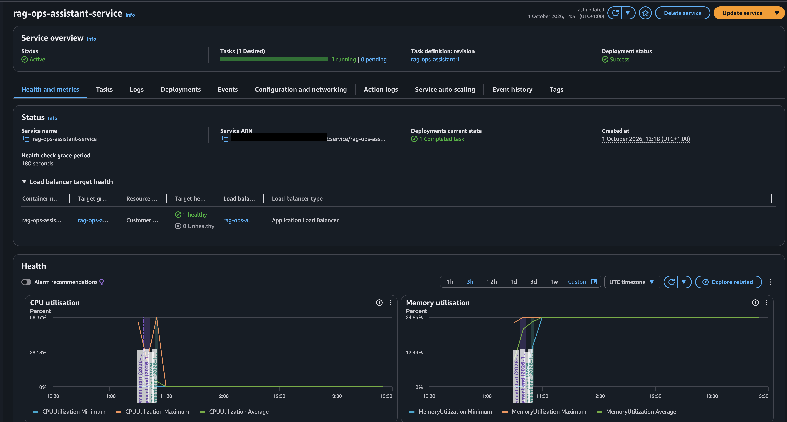
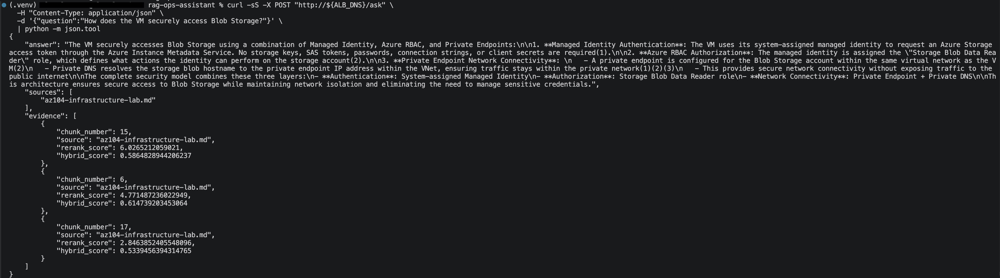

# RAG Ops Assistant

An AI-powered operations assistant that combines **Retrieval-Augmented Generation (RAG)**, **Amazon Bedrock**, **Model Context Protocol (MCP)**, **LangGraph**, and **FastAPI**, deployed as an ARM64 container on **Amazon ECS Fargate**.

The assistant answers questions from a curated operations knowledge base, exposes retrieval through MCP, uses LangGraph to orchestrate model and tool calls, and returns grounded responses with source and evidence metadata.

The project also demonstrates a complete container deployment workflow using **Docker, Amazon ECR, ECS Fargate, IAM, CloudWatch, and an Application Load Balancer**.

---

## Architecture

<p align="center">
  
</p>

The deployed request path is:

```text
Client
  |
  v
Application Load Balancer
  |
  v
ECS Service
  |
  v
ARM64 Fargate Task
  |
  v
FastAPI
  |
  v
LangGraph
  |
  +----------------------+
  |                      |
  | direct response      | tool_use
  |                      v
  |                  MCP Client
  |                      |
  |                      v
  |                  MCP Server
  |                      |
  |                      v
  |              search_knowledge_base
  |                      |
  |                      v
  |                  RAG Engine
  |              /               \
  |       Hybrid Search        Reranker
  |              \               /
  |               Grounded Evidence
  |                      |
  +----------------------+
             |
             v
        Amazon Bedrock
             |
             v
     Answer + Sources + Evidence
```

Supporting AWS services include:

```text
Amazon ECR
    |
    | container image
    v
ECS Fargate

Fargate
    |
    | logs
    v
CloudWatch Logs

Fargate
    |
    | temporary AWS credentials
    v
ECS Task IAM Role
    |
    v
Amazon Bedrock
```

---

## AWS Deployment

The application is deployed in **AWS eu-west-2** using Amazon ECS on AWS Fargate.

Current deployment characteristics:

- Linux ARM64 Fargate task
- 1 vCPU
- 2 GB memory
- FastAPI listening on container port `8000`
- Amazon ECR container registry
- Application Load Balancer health checks
- CloudWatch container logging
- Separate ECS execution and application task IAM roles
- IAM-based Bedrock access with no AWS credentials stored in the container
- Security-group isolation between the ALB and Fargate task

The current deployment is a personal project environment. The Application Load Balancer is restricted to the owner's current public `/32` address rather than being open to the entire internet.

The Fargate task currently runs in a public subnet with a public IP assigned, but direct inbound access to the task is blocked by its security group. Port `8000` accepts traffic only from the ALB security group.

---

## Deployment Architecture

```text
Developer
    |
    | docker build
    v
Docker Image
    |
    v
Amazon ECR
    |
    | image pull
    v
ECS Fargate
    |
    +----------------------------+
    |                            |
    v                            v
FastAPI                     CloudWatch Logs
    |
    v
LangGraph
    |
    v
MCP / RAG Retrieval
    |
    v
Amazon Bedrock
    ^
    |
ECS Task IAM Role
```

The ECS execution role is responsible for infrastructure-level operations such as:

- pulling the container image from ECR
- writing container logs to CloudWatch

The ECS task role is used by the application itself to call Amazon Bedrock.

---

## Container Security and Optimisation

The first Docker build pulled the default PyTorch dependency stack, including large CUDA/NVIDIA libraries that were unnecessary for an ARM64 CPU-only Fargate workload.

The original image was approximately:

```text
Local Docker image: ~9.94 GB
ECR compressed size: ~3.5 GB
```

Inspection showed several gigabytes were consumed by:

```text
nvidia
triton
torch
```

The image was rebuilt using **CPU-only PyTorch for ARM64**, which removed the unused NVIDIA/CUDA stack.

The optimized deployment image is approximately:

```text
ECR image size: ~586 MB
Architecture:   arm64/linux
PyTorch:        CPU only
CUDA:           disabled
```

The image also:

- uses `python:3.11-slim-trixie`
- installs current Debian security package updates during the build
- builds the RAG index into the container
- caches the embedding model
- caches the cross-encoder reranker
- avoids Docker provenance/attestation for the single-platform deployment image

### ECR Security Scan

<p align="center">
  
</p>

The documented deployment image scan completed with:

```text
Critical: 0
High:     2
Medium:   1
Low:      1
```

The remaining high-severity findings were reviewed as operating-system package findings. They were tracked rather than force-patched using packages outside the configured Debian repositories.

---

## ECS Fargate Service

The application runs as a persistent ECS service behind an Application Load Balancer.

<p align="center">
  
</p>

The current service configuration uses:

```text
Operating system: Linux
CPU architecture: ARM64
CPU:              1024 units / 1 vCPU
Memory:           2048 MiB
Container port:   8000
Desired tasks:    1
```

The Application Load Balancer performs health checks against:

```text
GET /health
```

The task security group accepts port `8000` traffic only from the ALB security group.

The ALB security group is restricted to the owner's current public `/32` address for this personal deployment.

---

## End-to-End AWS RAG Query

The `/ask` endpoint has been tested through the Application Load Balancer rather than directly against the container.

<p align="center">
  
</p>

The deployed response contains:

- a grounded model-generated answer
- source document names
- retrieved chunk numbers
- hybrid retrieval scores
- cross-encoder reranking scores

This validates the complete cloud path:

```text
Client
  |
  v
Application Load Balancer
  |
  v
ECS Fargate
  |
  v
FastAPI
  |
  v
LangGraph
  |
  v
MCP Tool
  |
  v
RAG Retrieval
  |
  v
Amazon Bedrock
  |
  v
Grounded Response
```

Amazon Bedrock is accessed from Fargate using the ECS task IAM role rather than mounted local credentials.

---

## Application Demo

### Grounded API Query

The `/ask` endpoint returns a grounded response together with the source documents and retrieval evidence used to support it.

<p align="center">
  
</p>

### MCP Tool Invocation Flow

The terminal trace below shows LangGraph routing a knowledge-base question to Amazon Bedrock, Bedrock requesting the MCP tool, the MCP server executing `search_knowledge_base`, and the retrieved evidence being returned before the final response.

<p align="center">
  
</p>

---

## Key Features

- Retrieval-Augmented Generation over operational documentation
- Hybrid semantic and keyword retrieval
- Sentence Transformer embeddings
- Cross-encoder reranking
- Amazon Bedrock / Amazon Nova integration
- MCP tool discovery and invocation
- LangGraph-based agent orchestration
- Hard no-evidence guard for unsupported questions
- FastAPI REST API
- Structured sources and evidence metadata
- Persistent MCP service
- Retrieval evaluation suite
- Automated API tests
- GitHub Actions CI
- Docker containerisation
- ARM64 CPU-only container optimisation
- Amazon ECR image storage and scanning
- ECS Fargate deployment
- Application Load Balancer
- IAM task-role authentication
- CloudWatch container logging

---

## Agent Routing

The LangGraph workflow supports three main paths.

### General Question

```text
User
  |
  v
Bedrock
  |
  v
end_turn
  |
  v
Final Answer
```

No MCP tool is required.

### Knowledge-Base Question

```text
User
  |
  v
Bedrock
  |
  v
tool_use
  |
  v
MCP
  |
  v
RAG Retrieval
  |
  v
Evidence Found
  |
  v
Bedrock
  |
  v
Grounded Answer
```

### Unsupported Knowledge-Base Question

```text
User
  |
  v
Bedrock
  |
  v
tool_use
  |
  v
MCP
  |
  v
RAG Retrieval
  |
  v
No Evidence
  |
  v
Hard LangGraph Guard
  |
  v
Fixed Abstention Response
```

The no-evidence path stops before the model can generate unsupported information.

---

## Knowledge Base

The current knowledge base contains documentation from several infrastructure and platform engineering projects:

- Azure infrastructure lab
- CloudOps Command Center
- Platform Engineering Observability
- PlatformPilot

Source documents are stored under:

```text
data/
```

Generated retrieval index files are stored under:

```text
index/
```

The generated `index/` directory is intentionally excluded from Git and is rebuilt during the Docker image build.

---

## Retrieval Pipeline

The retrieval system uses multiple stages:

```text
Question
  |
  v
Embedding
  |
  +-------------------+
  |                   |
  v                   v
Semantic Search   Keyword Search
  |                   |
  +---------+---------+
            |
            v
       Hybrid Score
            |
            v
     Candidate Results
            |
            v
   Cross-Encoder Reranker
            |
            v
    Relevance Filtering
            |
            v
      Grounded Context
```

Embedding model:

```text
sentence-transformers/all-MiniLM-L6-v2
```

Reranker:

```text
cross-encoder/ms-marco-MiniLM-L-6-v2
```

The vector index is stored locally using NumPy arrays and accompanying JSON chunk metadata.

---

## Project Structure

```text
rag-ops-assistant/
├── .github/
│   └── workflows/
│
├── data/
│   ├── az104-infrastructure-lab.md
│   ├── cloudops-command-center.md
│   ├── platform-engineering-observability.md
│   └── platform-pilot.md
│
├── deploy/
│   └── ecs/
│       ├── ecs-tasks-trust-policy.json
│       ├── bedrock-task-policy.example.json
│       └── ecs-task-definition.example.json
│
├── docs/
│   └── images/
│       ├── architecture-diagram.png
│       ├── aws-deployed-rag-query.png
│       ├── ecr-security-scan.png
│       ├── ecs-fargate-service.png
│       ├── grounded-query.png
│       └── mcp-flow-terminal.png
│
├── evals/
│   └── retrieval_cases.json
│
├── src/
│   ├── __init__.py
│   ├── agent.py
│   ├── api.py
│   ├── evaluate.py
│   ├── ingest.py
│   ├── langgraph_agent.py
│   ├── mcp_agent.py
│   ├── mcp_server.py
│   ├── rag_core.py
│   ├── retrieve.py
│   └── tools.py
│
├── tests/
│
├── .dockerignore
├── .gitignore
├── Dockerfile
├── README.md
├── requirements.txt
└── requirements-dev.txt
```

---

## Requirements

For local development:

- Python 3.11+
- AWS account with Amazon Bedrock access
- AWS CLI credentials/profile configured locally

Create the environment:

```bash
python -m venv .venv
source .venv/bin/activate
python -m pip install -r requirements.txt
```

Development/test dependencies can be installed with:

```bash
python -m pip install -r requirements-dev.txt
```

---

## Build the RAG Index

Run:

```bash
python -m src.ingest
```

This reads the Markdown documents in `data/`, chunks them, generates embeddings, and creates the local retrieval index.

Generated files are written under:

```text
index/
```

---

## Run Retrieval Evaluation

```bash
python -m src.evaluate
```

The evaluation suite checks retrieval behavior for supported and unsupported questions.

---

## Run Automated Tests

```bash
python -m pytest -v
```

The API tests mock the Bedrock/LangGraph service where appropriate so automated tests do not require live AWS calls.

GitHub Actions runs the automated test suite for repository changes.

---

## Test the MCP Server

Start the MCP server directly:

```bash
python -m src.mcp_server
```

The server exposes:

```text
search_knowledge_base
```

The tool accepts:

```text
question: string
```

and returns structured fields including:

```text
found
message
context
sources
evidence
```

---

## Run the LangGraph Agent

Set an AWS profile with Bedrock access:

```bash
AWS_PROFILE=<your-aws-profile> python -m src.langgraph_agent
```

Example question:

```text
How does the VM securely access Blob Storage?
```

The current Bedrock integration uses:

```text
global.amazon.nova-2-lite-v1:0
```

---

## Run the API Locally

Start FastAPI:

```bash
AWS_PROFILE=<your-aws-profile> \
python -m uvicorn src.api:app --reload
```

API documentation:

```text
http://127.0.0.1:8000/docs
```

Health endpoint:

```bash
curl http://127.0.0.1:8000/health
```

Expected response:

```json
{
  "status": "ok",
  "service": "rag-ops-assistant"
}
```

---

## Ask a Knowledge-Base Question

```bash
curl -X POST http://127.0.0.1:8000/ask \
  -H "Content-Type: application/json" \
  -d '{"question":"How does the VM securely access Blob Storage?"}'
```

Example response shape:

```json
{
  "answer": "Grounded answer generated from retrieved evidence.",
  "sources": [
    "az104-infrastructure-lab.md"
  ],
  "evidence": [
    {
      "chunk_number": 15,
      "source": "az104-infrastructure-lab.md",
      "rerank_score": 6.02,
      "hybrid_score": 0.58
    }
  ]
}
```

---

## No-Evidence Behaviour

For a question outside the knowledge base:

```bash
curl -X POST http://127.0.0.1:8000/ask \
  -H "Content-Type: application/json" \
  -d '{"question":"What is the company annual leave policy?"}'
```

The application returns:

```json
{
  "answer": "The knowledge base does not contain sufficient information to answer that question.",
  "sources": [],
  "evidence": []
}
```

This response is enforced by LangGraph control flow rather than relying only on prompt instructions.

---

## Run with Docker

The application can run locally as a Docker container.

The production-oriented image:

- uses Python 3.11 on Debian Trixie
- targets ARM64/Linux
- uses CPU-only PyTorch
- installs application dependencies
- applies selected Debian security updates
- copies the application and knowledge-base documents
- builds the RAG index
- caches the embedding model
- caches the reranker model
- starts FastAPI on port `8000`

### Build the Image

```bash
docker build \
  --provenance=false \
  -t rag-ops-assistant:latest .
```

Verify the architecture:

```bash
docker image inspect rag-ops-assistant:latest \
  --format '{{.Architecture}}/{{.Os}}'
```

Expected:

```text
arm64/linux
```

### Run Locally with AWS Credentials

For local Docker testing only, mount the AWS credentials directory read-only:

```bash
docker run --rm \
  -p 8001:8000 \
  -e AWS_PROFILE=<your-aws-profile> \
  -v "$HOME/.aws:/root/.aws:ro" \
  rag-ops-assistant:latest
```

Then test:

```bash
curl http://127.0.0.1:8001/health
```

and:

```bash
curl -X POST http://127.0.0.1:8001/ask \
  -H "Content-Type: application/json" \
  -d '{"question":"How does the VM securely access Blob Storage?"}'
```

### AWS Credentials on ECS

AWS credentials are **not mounted into the ECS container** and are not baked into the image.

Boto3 automatically receives temporary credentials from the ECS task role:

```text
Fargate Task
     |
     v
ECS Task Role
     |
     v
Temporary AWS Credentials
     |
     v
Amazon Bedrock
```

This removes the need to store static AWS access keys inside the deployed container.

---

## Amazon ECR

The optimized ARM64 image is pushed to Amazon ECR using a versioned tag.

Example:

```text
rag-ops-assistant:v3-arm64-cpu
```

Using versioned image tags makes it easier to identify and roll back deployment candidates.

ECR scan-on-push is enabled for the repository.

---

## ECS Deployment Configuration

Reusable example deployment files are stored under:

```text
deploy/ecs/
```

The examples use placeholders such as:

```text
<AWS_ACCOUNT_ID>
<AWS_REGION>
```

rather than publishing account-specific values.

### ECS Task Definition

The task definition uses:

```text
Launch type:        FARGATE
Operating system:   LINUX
CPU architecture:   ARM64
CPU:                1024
Memory:             2048 MiB
Network mode:       awsvpc
Container port:     8000
```

### IAM Roles

Two different roles are used.

```text
ECS Execution Role
    |
    +--> Pull image from ECR
    |
    +--> Write logs to CloudWatch


ECS Task Role
    |
    +--> Invoke Amazon Bedrock
```

This separates infrastructure permissions from application permissions.

---

## Networking and Security

The current personal deployment uses an internet-facing Application Load Balancer.

Traffic is restricted as follows:

```text
Owner public IP /32
        |
        | HTTP :80
        v
Application Load Balancer
        |
        | TCP :8000
        v
Fargate Task
```

The ALB security group accepts HTTP only from the owner's current `/32` address.

The task security group accepts TCP port `8000` only from the ALB security group.

The task therefore cannot be reached directly from the internet even though it currently has a public IP assigned by Fargate.

For a larger production deployment, the task could be moved into private subnets and outbound dependencies handled through NAT or VPC endpoints.

---

## CloudWatch Logging

The Fargate container uses the `awslogs` log driver.

Logs are written to:

```text
/ecs/rag-ops-assistant
```

This provides centralized visibility into:

- application startup
- MCP initialization
- Bedrock calls
- agent errors
- container failures

---

## Technology Stack

| Component | Technology |
|---|---|
| API | FastAPI |
| Agent orchestration | LangGraph |
| LLM | Amazon Bedrock / Amazon Nova |
| Bedrock model | Amazon Nova 2 Lite |
| Tool protocol | MCP |
| Embeddings | Sentence Transformers |
| Reranking | Cross Encoder |
| Retrieval | Hybrid semantic + keyword search |
| Vector storage | NumPy local index |
| Validation | Pydantic |
| AWS SDK | boto3 |
| Container runtime | Docker |
| Container registry | Amazon ECR |
| Compute | Amazon ECS / AWS Fargate |
| CPU architecture | ARM64 |
| Load balancing | Application Load Balancer |
| Logging | Amazon CloudWatch |
| Identity | AWS IAM task and execution roles |
| CI | GitHub Actions |

---

## Tested Python Dependency Versions

```text
boto3==1.43.104
fastapi==0.141.1
langgraph==1.2.12
mcp[cli]==2.2.0
numpy==2.4.6
pydantic==2.13.5
sentence-transformers==6.1.0
uvicorn==0.54.0
```

The Docker image installs a CPU-only PyTorch build separately to avoid unnecessary CUDA/NVIDIA dependencies.

---

## Design Principles

The project separates responsibilities across layers:

```text
RAG
= retrieves relevant evidence

MCP
= standardizes how retrieval is exposed as a tool

Bedrock
= selects tools and generates responses

LangGraph
= controls state, routing, loops, and guardrails

FastAPI
= exposes the system through an HTTP API

ECS Fargate
= runs the containerized application

IAM
= supplies temporary AWS permissions

ALB
= provides stable routing and health checks
```

A key design decision is that unsupported retrieval results are handled with application-level control flow:

```text
found = False
     |
     v
LangGraph END
     |
     v
Fixed Abstention Response
```

This prevents the model from generating unsupported information after the retrieval layer reports that no evidence exists.

---

## Current Status

The following flows have been tested successfully:

- health endpoint
- general direct-answer route
- known knowledge-base retrieval route
- unknown knowledge-base abstention route
- MCP tool discovery
- MCP tool execution
- persistent MCP service reuse
- structured sources and evidence
- empty-question validation
- retrieval evaluation
- automated API tests
- GitHub Actions CI
- Docker containerisation
- ARM64 CPU-only PyTorch optimisation
- local container `/health`
- local container `/ask`
- Amazon ECR image push
- Amazon ECR vulnerability scanning
- zero-critical deployment image
- ECS task definition registration
- ARM64 Fargate execution
- ECS service deployment
- IAM task-role authentication to Amazon Bedrock
- CloudWatch container logging
- Application Load Balancer routing
- ALB health checks
- end-to-end `/ask` request through the ALB
- security-group isolation between the ALB and Fargate task

---

## Future Improvements

Possible next iterations include:

- HTTPS with a custom domain and AWS Certificate Manager
- authentication and authorization for the API
- Infrastructure as Code with Terraform or AWS CDK
- automated Docker build and ECR push through GitHub Actions
- automated ECS deployments
- ECR enhanced vulnerability scanning
- LangGraph tracing and distributed observability
- ECS/Fargate autoscaling
- private-subnet task deployment
- VPC endpoints for AWS service access
- richer API rate limiting
- additional operational MCP tools
- expanded knowledge-base documents
- larger retrieval evaluation datasets

---

## Security Notes

This repository does not contain AWS access keys or secret credentials.

The ECS deployment uses IAM task credentials provided dynamically by AWS.

Account-specific deployment values should not be committed to the public repository. The files under `deploy/ecs/` should use placeholders for values such as:

```text
<AWS_ACCOUNT_ID>
<AWS_REGION>
```

Screenshots used in this README redact account identifiers, public IP addresses, and other deployment-specific values where appropriate.

---

## Author

**Olawale Azeez**

AWS Certified Developer – Associate
AWS Certified Solutions Architect – Associate
AWS Certified Cloud Practitioner

Cloud Engineer | Platform Engineer | DevOps Engineer