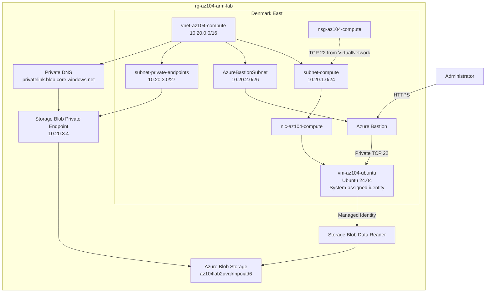

# AZ-104 Azure Infrastructure Lab

An Azure infrastructure project built while preparing for the Microsoft AZ-104 certification.

The lab demonstrates modular Bicep, private networking, Linux virtual machines, Azure Bastion, managed identities, scoped Azure RBAC, Azure Private Link, Private DNS, deployment review, troubleshooting, and operational verification.

---

## Project Overview

This lab follows a repeatable infrastructure deployment workflow:

```text
Build
  ↓
Validate
  ↓
What-If
  ↓
Deploy
  ↓
Verify
```

Infrastructure changes are developed incrementally and reviewed before deployment.

The project currently demonstrates:

- Modular Azure infrastructure using Bicep
- Regional VM SKU troubleshooting
- Private Linux VM deployment with no public IP
- NSG-based network controls
- Azure Bastion private administrative access
- Network Watcher connectivity validation
- System-assigned managed identity
- Scoped Azure RBAC
- Credential-free Azure Blob Storage access
- Deterministic RBAC deployment through Bicep
- Azure Storage Private Endpoint
- Azure Private DNS
- Private Blob name resolution
- Managed identity access over Azure Private Link
- ARM deployment-operation troubleshooting
- Cost-aware VM deallocation

The compute environment is deployed in Denmark East because an earlier UK South VM deployment encountered a subscription or regional SKU restriction.

---

# Infrastructure

| Component | Configuration |
|---|---|
| Resource group | `rg-az104-arm-lab` |
| Primary infrastructure region | UK South |
| Compute region | Denmark East |
| Compute virtual network | `vnet-az104-compute` |
| VNet address space | `10.20.0.0/16` |
| Compute subnet | `subnet-compute` — `10.20.1.0/24` |
| Bastion subnet | `AzureBastionSubnet` — `10.20.2.0/26` |
| Private Endpoint subnet | `subnet-private-endpoints` — `10.20.3.0/27` |
| Network security group | `nsg-az104-compute` |
| Network interface | `nic-az104-compute` |
| Virtual machine | `vm-az104-ubuntu` |
| Operating system | Ubuntu 24.04 LTS |
| VM size | `Standard_B1s` |
| VM public IP | None |
| VM authentication | SSH public key |
| VM identity | System-assigned managed identity |
| Bastion host | `bas-az104-compute` |
| Storage account | `az104lab2uvqlnnpoiad6` |
| Storage RBAC role | `Storage Blob Data Reader` |
| RBAC scope | Storage account |
| Blob Private Endpoint | `pe-az104lab2uvqlnnpoiad6-blob` |
| Private Endpoint IP | `10.20.3.4` |
| Private DNS zone | `privatelink.blob.core.windows.net` |
| Infrastructure as Code | Bicep |

---

# Architecture



The VM has no public IP address.

Azure Bastion provides private administrative access when required.

The VM authenticates to Azure using its system-assigned managed identity.

Azure RBAC authorizes the identity to read Blob data.

Azure Private Link provides the private network path to Blob Storage.

Azure Private DNS resolves the Storage Blob hostname to the private endpoint IP inside the VNet.

---

# Security Model

The lab separates three different security concerns:

```text
Authentication
      |
      | Who is making the request?
      v
System-assigned Managed Identity

Authorization
      |
      | What may the identity do?
      v
Storage Blob Data Reader

Network Connectivity
      |
      | How does the workload reach Storage?
      v
Private Endpoint + Private DNS
```

The resulting access path is:

```text
vm-az104-ubuntu
        |
        | Managed Identity
        v
Microsoft Entra ID
        |
        | Storage Blob Data Reader
        v
Azure Blob Storage
        ^
        |
        | Azure Private Link
        |
10.20.3.4
        ^
        |
Private DNS
privatelink.blob.core.windows.net
```

Security characteristics include:

- No VM public IP
- Password-based SSH disabled
- SSH public-key authentication
- SSH private key remains outside Git
- TCP 22 limited to the `VirtualNetwork` service tag
- Azure Bastion used for administrative access
- System-assigned managed identity
- Storage authorization through Azure RBAC
- Storage RBAC scoped to the Storage account
- No Storage account key required by the VM
- No SAS token required by the VM
- No client secret stored on the VM
- Blob traffic resolves to a private endpoint from the compute VNet
- Infrastructure changes reviewed with Azure What-If

The Storage account public-network configuration has not yet been fully disabled. This phase proves the private workload path first; restricting the public path is a later hardening exercise.

---

# Repository Layout

```text
.
├── azuredeploy.bicep
├── azuredeploy.json
├── dev.bicepparam
├── audit-project-tag-policy.json
│
├── modules/
│   ├── bastion.bicep
│   ├── bastion.json
│   ├── compute.bicep
│   ├── compute.json
│   ├── network.bicep
│   ├── network.json
│   ├── rbac.bicep
│   ├── rbac.json
│   ├── storage.bicep
│   ├── storage.json
│   ├── storage-private-endpoint.bicep
│   └── storage-private-endpoint.json
│
├── docs/
│   └── screenshots/
│       ├── bastion-connectivity-test.png
│       ├── bastion-ssh-success.png
│       ├── managed-identity-rbac.png
│       ├── managed-identity-storage-access.png
│       ├── nic-configuration.png
│       ├── nsg-ssh-rule.png
│       ├── vm-deallocated.png
│       └── what-if.png
│
├── README.md
└── learn.md
```

---

# Deployment Evidence

## Pre-deployment What-If Review

Infrastructure changes are reviewed with Azure What-If before deployment.

What-If is used to identify:

```text
Create
Modify
Delete
NoChange
Ignore
```

before infrastructure changes are applied.


The screenshot represents an earlier stage of the project. Later What-If previews changed as managed identity, RBAC, and Private Endpoint resources were introduced.

---

## VM Verification and Deallocation

The Linux VM was successfully provisioned in Denmark East using:

```text
Standard_B1s
```

The VM has no public IP address.

After validation exercises, the VM is deallocated to reduce unnecessary compute charges.


---

## Network Interface Configuration

The compute NIC connects:

```text
vm-az104-ubuntu
        ↓
nic-az104-compute
        ↓
subnet-compute
        ↓
vnet-az104-compute
```

The NIC has no public IP association.


---

## SSH Security Rule

The `Allow-SSH-From-VNet` NSG rule permits:

```text
Protocol: TCP
Port: 22
Source: VirtualNetwork
Priority: 100
```


Effective NSG rules were inspected during troubleshooting to verify that the rule was active on the VM network path.

---

# Phase 1 — Private VM Access with Azure Bastion

## Bastion Network Design

The compute VNet originally used:

```text
vnet-az104-compute
10.20.0.0/16

├── subnet-compute
│   10.20.1.0/24
│
└── AzureBastionSubnet
    10.20.2.0/26
```

Azure Bastion provides a management path while allowing the VM itself to remain private.

```text
Administrator Browser
        |
        | HTTPS
        v
Azure Bastion
        |
        | TCP 22 over VNet
        v
vm-az104-ubuntu
Private IP only
```

---

## Bastion-to-VM Connectivity

Azure Network Watcher Connection Troubleshoot was used to validate:

```text
Source:
bas-az104-compute

Destination:
vm-az104-ubuntu

Protocol:
TCP

Destination port:
22
```

The test reported the connection as reachable.


---

## Successful Bastion SSH Session

A successful SSH session was established through Azure Bastion.

Commands executed inside the VM included:

```bash
whoami
hostname
hostname -I
```

Recorded results:

```text
azureuser
vm-az104-ubuntu
10.20.1.4
```


This completed the private VM administration milestone without assigning a public IP to the VM.

---

# Phase 2 — Managed Identity and Scoped RBAC

## System-Assigned Managed Identity

The VM is configured with:

```bicep
identity: {
  type: 'SystemAssigned'
}
```

Azure creates and manages the corresponding Microsoft Entra service principal.

No client secret or application password is required.

---

## Scoped Storage RBAC

The VM identity receives:

```text
Storage Blob Data Reader
```

at the Storage account scope:

```text
az104lab2uvqlnnpoiad6
```

The relationship is:

```text
vm-az104-ubuntu
      |
      | System-assigned identity
      v
Storage Blob Data Reader
      |
      | Storage-account scope
      v
az104lab2uvqlnnpoiad6
```

---

## Deterministic RBAC Bicep

The RBAC configuration is managed through:

```text
modules/rbac.bicep
```

The role assignment uses a deterministic resource name generated from stable Azure resource identifiers.

This allowed Azure What-If to identify the role assignment before deployment instead of treating the resource ID as unknown.

---

## Portal RBAC Verification

Azure Portal IAM confirmed:

```text
Role:
Storage Blob Data Reader

Member:
vm-az104-ubuntu

Type:
Managed identity

Scope:
This resource
```


---

## Credential-Free Blob Access

The VM requested an Azure Storage access token through Azure Instance Metadata Service.

The token was then used to access Blob Storage.

No Storage key, SAS token, password, connection string, or client secret was required.


This proved:

```text
Managed Identity
        +
Microsoft Entra authentication
        +
Azure RBAC
```

---

# Phase 3 — Private Storage Connectivity

## Private Endpoint Network Design

A third subnet was introduced:

```text
vnet-az104-compute
10.20.0.0/16

├── subnet-compute
│   └── 10.20.1.0/24
│
├── AzureBastionSubnet
│   └── 10.20.2.0/26
│
└── subnet-private-endpoints
    └── 10.20.3.0/27
```

The new subnet is dedicated to private endpoints.

The Blob Private Endpoint is:

```text
pe-az104lab2uvqlnnpoiad6-blob
```

with private IP:

```text
10.20.3.4
```

---

## Private DNS

The deployment creates the Azure Private DNS zone:

```text
privatelink.blob.core.windows.net
```

The zone is linked to:

```text
vnet-az104-compute
```

The Private Endpoint also has a DNS zone group associating it with the Blob Private DNS zone.

---

## Private Endpoint Validation

Azure reported:

```text
ProvisioningState    ConnectionState
-------------------  ---------------
Succeeded            Approved
```

The private endpoint NIC received:

```text
10.20.3.4
```

The Private DNS zone was verified as:

```text
Name:
privatelink.blob.core.windows.net

Location:
global
```

---

## Private DNS Resolution from the VM

Private DNS was tested from:

```text
vm-az104-ubuntu
```

The normal Storage hostname:

```text
az104lab2uvqlnnpoiad6.blob.core.windows.net
```

resolved through:

```text
az104lab2uvqlnnpoiad6.privatelink.blob.core.windows.net
```

to:

```text
10.20.3.4
```

This confirmed that the VM resolved Azure Blob Storage to the private endpoint rather than using the normal public service IP.

---

## Managed Identity Access over Private Link

The VM requested an OAuth token from Azure Instance Metadata Service.

The token was used against:

```text
https://az104lab2uvqlnnpoiad6.blob.core.windows.net/
```

The request returned:

```text
HTTP/1.1 200 OK
```

and successfully listed the existing:

```text
identity-test
```

container.

This verified all three layers together:

```text
Authentication
    |
    +--> System-assigned managed identity

Authorization
    |
    +--> Storage Blob Data Reader

Network
    |
    +--> Private DNS
    +--> Private Endpoint
    +--> 10.20.3.4
```

---

## Partial Deployment Failure and Recovery

The first Private Storage deployment ended with an overall failure.

The failure was not caused by the Private Endpoint.

The active deployment also attempted to redeploy the existing VM using a different SSH public key.

Azure rejected the change:

```text
PropertyChangeNotAllowed

Changing property
'linuxConfiguration.ssh.publicKeys'
is not allowed.
```

Deployment operations were inspected using Azure CLI.

The results showed:

```text
storagePrivateEndpointModule    Succeeded
computeNetworkModule            Succeeded
computeModule                   Failed
```

This proved that the Storage Private Endpoint and network changes had already completed successfully before the unrelated VM update failed.

The deployment template was then narrowed so that this phase no longer redeploys the existing VM or RBAC configuration.

This keeps the active deployment focused on:

```text
Compute VNet configuration
Private Endpoint subnet
Storage Private Endpoint
Private DNS
VNet DNS link
```

---

# Current Active Deployment Scope

The current `azuredeploy.bicep` is intentionally focused on the Private Storage networking phase.

It manages:

```text
vnet-az104-compute
        |
        +--> subnet-compute
        |
        +--> AzureBastionSubnet
        |
        +--> subnet-private-endpoints

Storage Private Endpoint

Private DNS Zone

Private DNS VNet Link

Private DNS Zone Group
```

The VM, Bastion implementation, and RBAC modules remain in the repository as completed project phases, but they are not redeployed by the current root template.

This avoids modifying already validated resources unnecessarily.

---

# Deployment Workflow

## 1. Build

```bash
az bicep build --file modules/network.bicep

az bicep build \
  --file modules/storage-private-endpoint.bicep

az bicep build --file azuredeploy.bicep
```

---

## 2. Validate

```bash
az deployment group validate \
  --resource-group rg-az104-arm-lab \
  --template-file azuredeploy.bicep \
  --parameters dev.bicepparam
```

---

## 3. What-If

```bash
az deployment group what-if \
  --resource-group rg-az104-arm-lab \
  --template-file azuredeploy.bicep \
  --parameters dev.bicepparam
```

What-If is reviewed for unexpected:

```text
Deletes
Replacements
Unrelated modifications
```

before deployment.

---

## 4. Deploy

```bash
az deployment group create \
  --resource-group rg-az104-arm-lab \
  --name az104-private-storage \
  --template-file azuredeploy.bicep \
  --parameters dev.bicepparam
```

Azure deployments can create billable resources, so deployment previews are reviewed before applying changes.

---

# Verification Commands

## Verify the Private Endpoint

```bash
az network private-endpoint show \
  --resource-group rg-az104-arm-lab \
  --name pe-az104lab2uvqlnnpoiad6-blob \
  --query "{ProvisioningState:provisioningState,ConnectionState:privateLinkServiceConnections[0].privateLinkServiceConnectionState.status}" \
  --output table
```

Expected:

```text
Succeeded    Approved
```

---

## Verify the Private Endpoint IP

```bash
NIC_ID=$(az network private-endpoint show \
  --resource-group rg-az104-arm-lab \
  --name pe-az104lab2uvqlnnpoiad6-blob \
  --query "networkInterfaces[0].id" \
  --output tsv)

az network nic show \
  --ids "$NIC_ID" \
  --query "ipConfigurations[0].privateIPAddress" \
  --output tsv
```

Expected:

```text
10.20.3.4
```

---

## Verify Private DNS

```bash
az network private-dns zone show \
  --resource-group rg-az104-arm-lab \
  --name privatelink.blob.core.windows.net \
  --query "{Name:name,Location:location}" \
  --output table
```

---

## Verify DNS from the VM

```bash
az vm run-command invoke \
  --resource-group rg-az104-arm-lab \
  --name vm-az104-ubuntu \
  --command-id RunShellScript \
  --scripts "getent hosts az104lab2uvqlnnpoiad6.blob.core.windows.net"
```

Expected private address:

```text
10.20.3.4
```

---

## Verify the VM

```bash
az vm show \
  --resource-group rg-az104-arm-lab \
  --name vm-az104-ubuntu \
  --show-details \
  --query "{Name:name,Location:location,Size:hardwareProfile.vmSize,ProvisioningState:provisioningState,PowerState:powerState,PrivateIP:privateIps,PublicIP:publicIps}" \
  --output table
```

---

## Verify Managed Identity

```bash
az vm identity show \
  --resource-group rg-az104-arm-lab \
  --name vm-az104-ubuntu \
  --query "{PrincipalId:principalId,TenantId:tenantId,Type:type}" \
  --output table
```

Expected:

```text
SystemAssigned
```

---

## Verify Subnets

```bash
az network vnet subnet list \
  --resource-group rg-az104-arm-lab \
  --vnet-name vnet-az104-compute \
  --query "[].{Name:name,AddressPrefix:addressPrefix}" \
  --output table
```

Expected:

```text
subnet-compute              10.20.1.0/24
AzureBastionSubnet          10.20.2.0/26
subnet-private-endpoints    10.20.3.0/27
```

---

## Inspect Deployment Operations

If a deployment fails:

```bash
az deployment operation group list \
  --resource-group rg-az104-arm-lab \
  --name az104-private-storage \
  --query "[].{Resource:properties.targetResource.resourceName,Type:properties.targetResource.resourceType,State:properties.provisioningState}" \
  --output table
```

This helps identify which nested resources succeeded and which failed.

---

# Troubleshooting and Engineering Decisions

## Regional VM SKU Restriction

The original compute deployment attempted to use UK South.

The selected VM SKU was unavailable or restricted for the subscription in that region.

A separate:

```text
computeLocation
```

parameter was introduced.

The compute environment was successfully deployed in Denmark East.

This demonstrated the importance of distinguishing an infrastructure-code problem from a regional or subscription availability constraint.

---

## Bastion Troubleshooting

Initial Bastion browser sessions failed before a working SSH session was established.

Troubleshooting separated:

```text
Network reachability
        ↓
Routing
        ↓
Security rules
        ↓
SSH listener
        ↓
Authentication
        ↓
Client configuration
```

Network Watcher confirmed the TCP/22 path was healthy.

The final problem was that the browser file picker had selected the wrong local SSH private key.

After choosing the correct key, SSH succeeded.

---

## Managed Identity and RBAC

Managed identity answers:

```text
Who is the VM?
```

Azure RBAC answers:

```text
What is the VM allowed to do?
```

The VM identity receives:

```text
Storage Blob Data Reader
```

at the Storage account scope.

---

## Private Endpoint and Private DNS

Private Endpoint answers:

```text
Which private network path reaches the service?
```

Private DNS answers:

```text
How does the workload discover that private path?
```

Both are required for the intended Private Link experience.

---

## ARM Partial Success

The Private Storage deployment demonstrated that a top-level ARM deployment can fail while some nested deployments have already succeeded.

The correct response was not to immediately delete or redeploy everything.

Instead, deployment operations and actual Azure resource states were inspected first.

---

## Immutable VM Configuration

The deployment attempted to change:

```text
linuxConfiguration.ssh.publicKeys
```

on the existing VM.

Azure rejected this in-place modification.

The solution was to remove the unrelated compute deployment from the active Private Storage root template rather than recreating the VM.

---

# Cost Management

The VM is deallocated when it is not required:

```bash
az vm deallocate \
  --resource-group rg-az104-arm-lab \
  --name vm-az104-ubuntu
```

Verify:

```bash
az vm get-instance-view \
  --resource-group rg-az104-arm-lab \
  --name vm-az104-ubuntu \
  --query "instanceView.statuses[?starts_with(code, 'PowerState/')].displayStatus" \
  --output tsv
```

Expected:

```text
VM deallocated
```

Managed disks and some networking resources can continue to incur charges while compute is deallocated.

Azure Bastion and Private Endpoint resources can also have associated costs, so temporary lab resources should be reviewed after each exercise.

---

# Current Progress

```text
[Complete] Modular Bicep compute deployment
[Complete] Private Linux VM
[Complete] No VM public IP
[Complete] SSH public-key authentication
[Complete] NSG validation
[Complete] Azure Bastion deployment
[Complete] Private Bastion SSH session
[Complete] Network Watcher validation
[Complete] System-assigned managed identity
[Complete] Storage Blob Data Reader RBAC
[Complete] Deterministic RBAC through Bicep
[Complete] Credential-free Blob access
[Complete] Private Endpoint subnet
[Complete] Azure Storage Blob Private Endpoint
[Complete] Private DNS zone
[Complete] VNet Private DNS link
[Complete] Private Blob name resolution
[Complete] Managed identity access over Private Link
[Complete] ARM partial-failure investigation
[Complete] VM deallocation after validation

[Next] Storage public-network hardening review
[Next] Azure Monitor Agent
[Next] Log Analytics
[Next] Data Collection Rules
[Next] KQL queries
[Next] Azure Monitor alerts
[Next] Azure Policy
[Next] Backup and recovery
[Next] GitHub Actions Bicep validation
[Next] Pull Request What-If
[Next] GitHub-to-Azure OIDC
```

---

# Next Phase — Azure Monitoring and Operations

The next major phase will introduce Azure-native monitoring.

Planned components include:

```text
Azure Monitor Agent
        ↓
Data Collection Rule
        ↓
Log Analytics Workspace
        ↓
KQL Queries
        ↓
Azure Monitor Alerts
```

The goal is to move from:

```text
Infrastructure exists
```

to:

```text
Infrastructure is observable and operationally verifiable
```

---

# Future Work

Future exercises include:

- Storage public-network hardening review
- Azure Monitor Agent
- Log Analytics workspace
- Data Collection Rules
- VM metrics and guest logs
- KQL queries
- Azure Monitor alerts
- Azure Policy definitions and assignments
- deliberate policy non-compliance testing
- policy remediation
- Recovery Services Vault
- VM backup
- recovery-point validation
- restore testing
- GitHub Actions Bicep validation
- Pull Request What-If
- Azure authentication through GitHub OIDC
- continued module cleanup and refactoring

---

# Learning Notes

See [learn.md](learn.md) for detailed troubleshooting decisions, deployment observations, and lessons learned throughout the lab.

---

## Author

**Olawale Azeez**

AWS Certified Developer – Associate  
AWS Certified Solutions Architect – Associate  
AWS Certified Cloud Practitioner

**Platform Engineer | AWS & Azure | Kubernetes | Terraform & Bicep | GitOps | CI/CD**